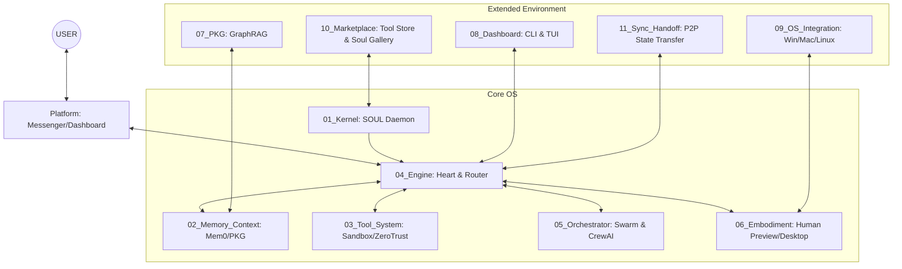

# Agent Base OS — 核心架構藍圖 (v5.0)


為 AI Agent 打造的作業系統級基礎設施平台。
**不是 APP，是 OS。** 貼上 API Key，3 分鐘內擁有一個高智商、全副武裝的 AI Agent。對新手友善，對資深玩家實用，所有參數可自訂。閒置 RAM < 60MB，峰值 < 150MB，無 GPU，零風扇。

> **🏛️ OS 最高設計準則：AgentOS 不禁止任何事情。它提供安全、經濟的預設值，但所有決策權歸 USER 所有。我們做的是平台載具，不是規則制定者。**

---

## 🚀 Quick Start

安裝 Agent Base OS 最快的方法：

### 方式一：本地安裝 (推薦給開發者)
```bash
# 複製專案
git clone https://github.com/your-repo/Agent_Base_OS.git
cd Agent_Base_OS

# 安裝主程式與所有可選依賴
pip install -e ".[all]"

# 啟動 Onboarding Wizard
python start.py
```

### 方式二：Docker 容器化 (推薦給生產環境)
```bash
# 使用 Docker Compose 一鍵啟動 (包含 PostgreSQL, Neo4j, Redis)
docker-compose up -d

# 進入容器內部使用 CLI 管理工具
docker exec -it agent_os_daemon bash
python 08_Dashboard/cli_commands.py audit
```

---

## 架構總覽：4 核心 + 2 平台 + 11 模組

AgentOS v5.0 已擴展為涵蓋作業系統整合、協同網狀網路與市集生態的全面解決方案。



---

## 核心系統 11 大模組列表

1. **`01_Kernel` — 靈魂與進程守護者**：載入 `SOUL.md` 與系統守護行程。
2. **`02_Memory_Context` — 混合記憶池**：整合 Mem0 (向量) 支援，作為上下文高速快取。
3. **`03_Tool_System` — 囚犯沙盒**：WASM/Subprocess 隔離執行，避免本機崩壞。
4. **`04_Engine` — 決策引擎與安全閥**：涵蓋 SmartRouter (動態省錢路由)、ZeroTrust (零信任人工審核放行) 與 Audit Trail 監控。
5. **`05_Orchestrator` — 網狀協同總線**：支援 LangGraph DAG、CrewAI 角色分派與非同步 Agent to Agent (A2A) 通訊。
6. **`06_Embodiment` — 人機具像化**：Desktop Runtime 控制與 Human Preview 可視化介入。
7. **`07_PKG` — 專屬知識圖譜**：GraphRAG 核心，提供 NetworkX 備援與 Neo4j 關聯式記憶。
8. **`08_Dashboard` — 觀測儀表板**：TUI (rich.live) 面板與命令列 Audit 操作。
9. **`09_OS_Integration` — 作業系統掛鉤**：跨平台 (Windows/macOS/Wayland/X11) 的鍵盤滑鼠模擬與視窗讀取。
10. **`10_Marketplace` — 靈魂與套件市集**：內建 M-Token 虛擬貨幣驅動的 Agent 工具 / `SOUL.md` 交換平台。
11. **`11_Sync_Handoff` — P2P 接力傳輸**：保存執行快照 (Checkpoints) 與 WebSocket 本地網域無縫狀態轉移。

---

## 🎨 使用者體驗層 (UX Layer) — 2027 新手友善設計

### 💰 Cost Guard (預算守衛)與智慧路由
OS 內建透明的 Token 用量控制機制與智慧路由，以降低不必要的花費：
- 大腦分離 (Smart Router)：依據任務複雜度，自動分配至本機 NPU 運算或是雲端 GPT-4o。
- 每日上限防護：達到 `budget.daily_limit_m` 自動斷電並主動提示。

### 🛡️ Zero Trust 與 Human-in-the-Loop
「不相信任何 LLM，包括最聰明的」。
- 新增 Zero Trust 模組攔截 `rm -rf` 等極端系統操作，並呼叫終端機 `Interactive Prompt` 等待人類按 `Y` 放行。
- Subprocess 沙盒內強制剔除 `OPENAI_API_KEY` 與切斷 `http_proxy` 避免網路越權。

### 📋 任務計畫可視化 (Plan Preview)
Agent 執行複雜任務前，透過 `SYS_ASK_HUMAN` 或是 `08_Dashboard/cli_commands.py simulate` 展示 10 步預測計畫 (含 RiskLevel)，確保一切在掌握之中。

---

## 統一設定檔 `config.yaml` 範例

```yaml
# 靈魂
kernel:
  soul_path: ./SOUL.md

# API 閘道
gateway:
  providers:
    - name: openai
      api_key: encrypted_sk_xxx # 支援 Fernet 加密儲存
      models: [gpt-4o, gpt-4o-mini]
  agents:
    default: openai/gpt-4o

# 引擎與隔離
engine:
  streaming: true
  zero_trust_enabled: true
sandbox:
  default_network: deny    # deny | allow
  timeout_seconds: 60

# 預算守衛 (單位：M = 百萬 Token)
budget:
  daily_limit_m: 1.0        # 每日上限 1M Token
```
