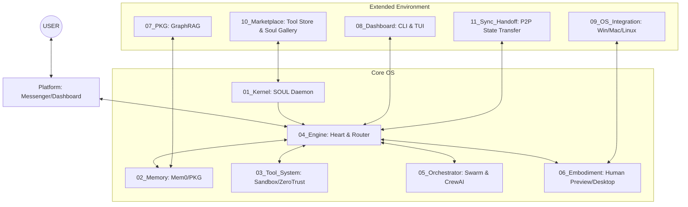

# Agent Base OS — Core Architecture Blueprint (v5.0)

[繁體中文](./README.md) | **English**


An OS-level infrastructure platform built for AI Agents.
**It's not an APP, it's an OS.** Paste your API Key, and within 3 minutes you'll have a highly intelligent, fully-armed AI Agent. Beginner-friendly yet extremely practical for power users. All parameters are customizable. Idle RAM < 60MB, Peak RAM < 150MB, no GPU required, zero fan noise.

> **🏛️ OS Supreme Design Principle: AgentOS forbids nothing. It provides secure and economical defaults, but all decision-making power belongs to the USER. We build the platform vehicle, not the rule maker.**

---

## 🚀 Quick Start

The fastest way to install Agent Base OS:

### Method 1: Local Installation (Recommended for Developers)
```bash
# Clone the repository
git clone https://github.com/whiletrue247/AgentOS.git
cd AgentOS

# Install the main program and all optional dependencies
pip install -e ".[all]"

# Launch the Onboarding Wizard
python start.py
```

### Method 2: Docker Containerization (Recommended for Production)
```bash
# One-click start using Docker Compose (includes PostgreSQL, Neo4j, Redis)
docker-compose up -d

# Enter the container to use the CLI management tool
docker exec -it agent_os_daemon bash
python 08_Dashboard/cli_commands.py audit
```

---

## Architecture Overview: 4 Cores + 2 Platforms + 11 Modules

AgentOS v5.0 has expanded into a comprehensive solution encompassing OS integration, collaborative mesh networking, and a marketplace ecosystem.



---

## List of 11 Core Modules

1. **`01_Kernel` — Soul and Process Daemon**: Loads `SOUL.md` and system guardians.
2. **`02_Memory` — Hybrid Memory Pool**: Integrates Mem0 (vector) support as a fast contextual cache.
3. **`03_Tool_System` — Prisoner Sandbox**: WASM/Subprocess isolated execution to prevent host system crashes.
4. **`04_Engine` — Decision Engine & Safety Valve**: Includes SmartRouter (dynamic cost-saving routing), ZeroTrust (manual human review gate), and Audit Trail monitoring.
5. **`05_Orchestrator` — Mesh Sync Bus**: Supports LangGraph DAG, CrewAI role dispatch, and async Agent-to-Agent (A2A) communication.
6. **`06_Embodiment` — Human-Machine Embodiment**: Desktop Runtime control and Human Preview visualization intervention.
7. **`07_PKG` — Personal Knowledge Graph**: GraphRAG core, providing NetworkX fallback and Neo4j relational memory.
8. **`08_Dashboard` — Observability Dashboard**: TUI (rich.live) panels and CLI Audit operations.
9. **`09_OS_Integration` — Operating System Hooks**: Cross-platform (Windows/macOS/Wayland/X11) keyboard/mouse simulation and window reading.
10. **`10_Marketplace` — Soul & Plugin Store**: Built-in M-Token virtual currency-driven Agent tools / `SOUL.md` exchange platform.
11. **`11_Sync_Handoff` — P2P Relay Transfer**: Preserves execution snapshots (Checkpoints) and enables seamless state transfer across the local WebSockets network.

---

## 🎨 User Experience Layer (UX Layer) — 2027 Beginner-Friendly Design

### 💰 Cost Guard & Smart Routing
The OS features an integrated, transparent Token usage control mechanism and smart routing to reduce unnecessary expenses:
- **Brain Split (Smart Router)**: Automatically routes tasks to local NPU computations or cloud-based GPT-4o depending on task complexity.
- **Daily Limit Protection**: Automatically cuts power and alerts the user upon reaching the `budget.daily_limit_m`.

### 🛡️ Zero Trust & Human-in-the-Loop
"Trust no LLM, not even the smartest ones."
- Introduced a Zero Trust module to intercept extreme system operations like `rm -rf`, invoking the interactive terminal prompt to wait for human `Y` approval.
- The Subprocess Sandbox forcefully strips the `OPENAI_API_KEY` and cuts off `http_proxy` to prevent unauthorized network access.

### 📋 Action Plan Visualization (Plan Preview)
Before executing complex tasks, the Agent uses `SYS_ASK_HUMAN` or `08_Dashboard/cli_commands.py simulate` to present a 10-step predicted plan (including RiskLevel) to ensure everything is under control.

---

## Unified Configuration Example `config.yaml`

```yaml
# Soul
kernel:
  soul_path: ./SOUL.md

# API Gateway
gateway:
  providers:
    - name: openai
      api_key: encrypted_sk_xxx # Supports Fernet encrypted storage
      models: [gpt-4o, gpt-4o-mini]
  agents:
    default: openai/gpt-4o

# Engine & Isolation
engine:
  streaming: true
  zero_trust_enabled: true
sandbox:
  default_network: deny    # deny | allow
  timeout_seconds: 60

# Budget Guard (Unit: M = Million Tokens)
budget:
  daily_limit_m: 1.0        # Daily cap of 1M Tokens
```
