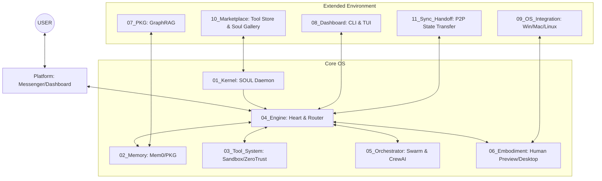

# Agent Base OS — Core Architecture Blueprint (v5.1)

[🇹🇼 繁體中文版](./README.md) | **English**


An OS-level infrastructure platform built for AI Agents.
**Not an APP — it's an OS.** Paste your API Key, and within 3 minutes you'll have a high-IQ, fully-armed AI Agent. Beginner-friendly, power-user ready, every parameter customizable. Idle RAM < 60MB, peak < 150MB, no GPU, zero fan noise.

> **🏛️ OS Supreme Design Principle: AgentOS prohibits nothing. It provides safe, economical defaults, but all decision-making power belongs to the USER. We build the platform vehicle, not the rule-maker.**

---

## 🚀 Quick Start

### Option 1: Local Install (Recommended for Developers)
```bash
# Clone the repo
git clone https://github.com/whiletrue247/AgentOS.git
cd AgentOS

# Install with all optional dependencies
pip install -e ".[all]"

# Launch the Onboarding Wizard
python start.py
```

### Option 2: Docker (Recommended for Production)
```bash
# One-click start with Docker Compose (includes PostgreSQL, Neo4j, Redis)
docker-compose up -d

# Access CLI management tools inside the container
docker exec -it agent_os_daemon bash
python 08_Dashboard/cli_commands.py audit
```

---

## Architecture Overview: 4 Core + 2 Platform + 11 Modules

AgentOS v5.1 has expanded into a comprehensive solution covering OS integration, collaborative mesh networks, and marketplace ecosystems.



---

## Core System: 11 Modules

| # | Module | Description |
|---|--------|-------------|
| 01 | **Kernel** | Loads `SOUL.md` as the Agent's core System Prompt. Hash caching for fast startup. |
| 02 | **Memory** | Hybrid memory pool with Mem0 (vector) support. Access-count decay for intelligent forgetting. |
| 03 | **Tool System** | Docker/E2B sandbox isolation with AST security scanning for plugin installations. |
| 04 | **Engine** | Decision engine with SmartRouter (dynamic cost-aware routing), ZeroTrust (human-in-the-loop), Prompt Injection Detector, and Audit Trail. |
| 05 | **Orchestrator** | Multi-agent coordination via LangGraph DAG, CrewAI roles, and async A2A communication. |
| 06 | **Embodiment** | Desktop Runtime control and Human Preview visualization. |
| 07 | **PKG** | Personal Knowledge Graph with GraphRAG, NetworkX fallback, and Neo4j support. |
| 08 | **Dashboard** | TUI (rich.live) panels and CLI audit commands with OpenTelemetry integration. |
| 09 | **OS Integration** | Cross-platform (Windows/macOS/Wayland/X11) keyboard/mouse simulation. |
| 10 | **Marketplace** | M-Token virtual currency-driven Agent tool and SOUL.md exchange platform. |
| 11 | **Sync Handoff** | Checkpoint snapshots and WebSocket local-network seamless state transfer. |

---

## 🎨 User Experience Layer

### 💰 Cost Guard & Smart Routing
- **Smart Router**: Automatically routes tasks to local NPU or cloud GPT-4o based on complexity, with dynamic scoring based on historical success rate, latency, and cost.
- **Daily Budget Protection**: Auto-cutoff when `budget.daily_limit_m` is reached.

### 🛡️ Zero Trust & Human-in-the-Loop
- Zero Trust module intercepts extreme operations like `rm -rf` and waits for human `Y` approval.
- Docker sandbox strips `OPENAI_API_KEY` and blocks `http_proxy` to prevent privilege escalation.
- **Prompt Injection Detector**: Three-layer detection (rules + heuristics + statistical analysis) covering 11 attack patterns.

### 📋 Task Plan Preview
Agent displays a 10-step prediction plan (with RiskLevel) before executing complex tasks, ensuring full visibility.

---

## Configuration Example (`config.yaml`)

```yaml
# Soul
kernel:
  soul_path: ./SOUL.md

# API Gateway
gateway:
  providers:
    - name: openai
      api_key: encrypted_sk_xxx  # Supports Fernet encrypted storage
      models: [gpt-4o, gpt-4o-mini]
  agents:
    default: openai/gpt-4o

# Engine & Isolation
engine:
  streaming: true
  zero_trust_enabled: true
sandbox:
  default_network: deny    # deny | allow
  timeout_seconds: 60

# Budget Guard (unit: M = million tokens)
budget:
  daily_limit_m: 1.0        # Daily limit 1M tokens
```

---

## 🔧 Development

```bash
# Install dev dependencies
pip install -e ".[dev]"

# Run tests
pytest tests/ -v --cov

# Lint
ruff check . && ruff format --check .

# Security scan
bandit -r . -c pyproject.toml -ll
```

See [CONTRIBUTING.md](./CONTRIBUTING.md) for contribution guidelines and [Plugin Development Guide](./docs/plugin_dev_guide.md) for building custom tools.

---

## 📄 License

MIT License — see [LICENSE](./LICENSE) for details.
