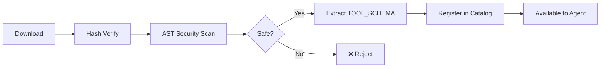

# AgentOS Plugin Development Guide

This guide walks you through building, testing, and distributing custom tools (plugins) for AgentOS.

---

## Plugin Architecture

AgentOS plugins are Python scripts that follow a standard structure. They are installed via the `SYS_TOOL_INSTALL` system tool and executed within a sandboxed environment.

```
your_plugin/
├── tool.py          # Main plugin file with TOOL_SCHEMA
├── manifest.json    # Plugin metadata (optional, for Marketplace)
├── tests/
│   └── test_tool.py # Unit tests
└── README.md        # Documentation
```

---

## Quick Start: Hello World Plugin

### 1. Create `tool.py`

```python
"""
My Hello World Plugin for AgentOS.
Demonstrates the minimal plugin structure.
"""

# REQUIRED: TOOL_SCHEMA defines how the Agent sees and uses your tool
TOOL_SCHEMA = {
    "name": "hello_world",
    "description": "A simple greeting tool that says hello to the user.",
    "parameters": {
        "type": "object",
        "properties": {
            "name": {
                "type": "string",
                "description": "Name of the person to greet"
            },
            "language": {
                "type": "string",
                "enum": ["en", "zh", "ja"],
                "default": "en",
                "description": "Language for the greeting"
            }
        },
        "required": ["name"]
    },
    "requires_network": False
}


def execute(arguments: dict) -> str:
    """Main entry point — called by AgentOS when the tool is invoked."""
    name = arguments.get("name", "World")
    language = arguments.get("language", "en")
    
    greetings = {
        "en": f"Hello, {name}! 👋",
        "zh": f"你好，{name}！👋",
        "ja": f"こんにちは、{name}！👋",
    }
    
    return greetings.get(language, greetings["en"])
```

### 2. Create `manifest.json` (Optional)

```json
{
    "name": "hello_world",
    "version": "1.0.0",
    "author": "Your Name",
    "description": "A simple greeting tool",
    "license": "MIT",
    "agentos_min_version": "5.0.0",
    "tags": ["greeting", "demo", "starter"],
    "install_type": "local_plugin"
}
```

### 3. Install Your Plugin

```bash
# From local file
python -c "
from 03_Tool_System.installer import ToolInstaller
from 03_Tool_System.catalog import ToolCatalog
catalog = ToolCatalog()
installer = ToolInstaller(catalog)
installer.install('hello_world', 'local_plugin', './your_plugin/tool.py', expected_hash='<sha256>')
"
```

---

## Security Requirements

All local plugins undergo **automatic security scanning** before installation:

### ❌ Forbidden Patterns (will be rejected)

| Pattern | Reason |
|---------|--------|
| `exec()`, `eval()`, `compile()` | Arbitrary code execution |
| `import subprocess` | System command execution |
| `import os` | File system / process access |
| `import shutil` | File manipulation |
| `import ctypes` | Native code execution |
| `__import__()` | Dynamic import bypass |

### ✅ Safe Patterns

| Pattern | Usage |
|---------|-------|
| `import json` | Data parsing |
| `import re` | Text processing |
| `import math` | Calculations |
| `import datetime` | Time handling |
| `import hashlib` | Hashing |
| `import urllib.parse` | URL parsing (no network) |

### Hash Verification

All plugins require a SHA-256 hash for integrity verification:

```bash
# Generate hash for your plugin
sha256sum tool.py
# or on macOS:
shasum -a 256 tool.py
```

---

## Plugin Lifecycle



---

## Testing Your Plugin

```python
# tests/test_tool.py
from your_plugin.tool import execute, TOOL_SCHEMA

def test_schema_exists():
    assert "name" in TOOL_SCHEMA
    assert "parameters" in TOOL_SCHEMA

def test_execute_basic():
    result = execute({"name": "Alice"})
    assert "Alice" in result

def test_execute_chinese():
    result = execute({"name": "小明", "language": "zh"})
    assert "小明" in result
```

Run tests:
```bash
pytest your_plugin/tests/ -v
```

---

## Publishing to Marketplace

1. Ensure your plugin passes all security scans
2. Add a `manifest.json` with proper metadata
3. Push to a GitHub repository
4. Submit via the AgentOS Marketplace (coming soon)

---

## API Reference

### `TOOL_SCHEMA` (Required)

A module-level dictionary defining your tool's interface:

| Field | Type | Required | Description |
|-------|------|----------|-------------|
| `name` | `str` | ✅ | Unique tool identifier |
| `description` | `str` | ✅ | What the tool does (shown to Agent) |
| `parameters` | `dict` | ✅ | JSON Schema for function arguments |
| `requires_network` | `bool` | ❌ | Whether the tool needs internet (default: `False`) |

### `execute(arguments: dict) -> str` (Required)

The main entry point called by AgentOS. Receives parsed arguments matching your schema, returns a string result.
