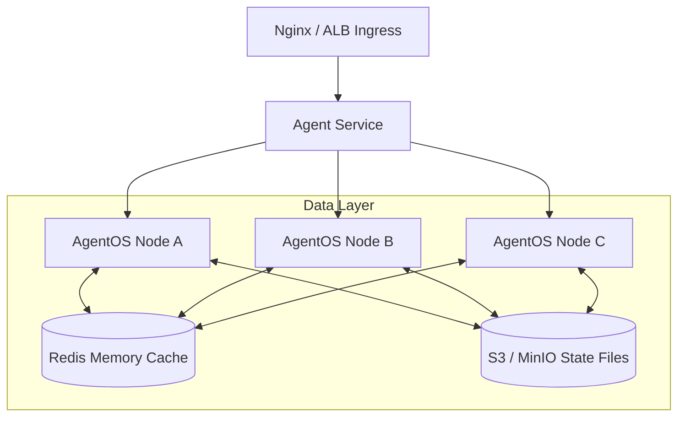

# AgentOS Reference Architecture: Kubernetes Deployment & Sync Handoff

This guide provides a reference architecture for deploying AgentOS in a production Kubernetes (K8s) environment, specifically highlighting how to scale multiple Agent Nodes and utilize the `11_Sync_Handoff` module to transfer state.

## 1. High-Level Architecture

When deploying in a cloud-native K8s environment, AgentOS operates seamlessly across multiple Pods. The `11_Sync_Handoff` module allows Agent instances to preserve their Short-Term Memory, Execution State, and GraphRAG context across pod restarts or pod-to-pod handoffs.



## 2. Dockerizing AgentOS

### Example `Dockerfile`
A robust `Dockerfile` for AgentOS ensures minimal image size while retaining essential dependencies.

```dockerfile
FROM python:3.12-slim

ENV PYTHONUNBUFFERED=1 \
    DEBIAN_FRONTEND=noninteractive

WORKDIR /app

# Install system dependencies (e.g., for Playwright/CDP or compilation)
RUN apt-get update && apt-get install -y --no-install-recommends \
    build-essential curl && \
    rm -rf /var/lib/apt/lists/*

COPY pyproject.toml .
RUN pip install --no-cache-dir .[all]

COPY . /app

# The default CLI loop or API Server
CMD ["python", "start.py"]
```

## 3. Kubernetes Manifests

### Deployment (`deployment.yaml`)
To scale AgentOS, you map the `11_Sync_Handoff` storage location to a Persistent Volume (PV) or a shared object store.

```yaml
apiVersion: apps/v1
kind: Deployment
metadata:
  name: agentos-deployment
  labels:
    app: agentos
spec:
  replicas: 3
  selector:
    matchLabels:
      app: agentos
  template:
    metadata:
      labels:
        app: agentos
    spec:
      containers:
      - name: agentos-node
        image: your-registry.com/agentos:v5.0
        env:
          - name: AGENTOS_ENV
            value: "production"
          - name: OPENAI_API_KEY
            valueFrom:
              secretKeyRef:
                name: agentos-secrets
                key: openai_key
          # Sync Handoff configuration
          - name: SYNC_BACKEND
            value: "redis" # or 's3'
          - name: REDIS_URL
            value: "redis://redis-service:6379"
        resources:
          requests:
            memory: "256Mi"
            cpu: "250m"
          limits:
            memory: "512Mi"
            cpu: "1000m"
        volumeMounts:
          - name: config-volume
            mountPath: /app/config.yaml
            subPath: config.yaml
      volumes:
        - name: config-volume
          configMap:
            name: agentos-config
```

## 4. Understanding `11_Sync_Handoff`

The `11_Sync_Handoff` module prevents execution loss during pod termination or autoscaling events (e.g., Spot Instance interruption).

### Handoff Flow
1. **Trigger**: An OS signal (SIGTERM from K8s) or an explicit `transfer_state` command is issued.
2. **Snapshot**: `11_Sync_Handoff` gathers the current AST (Abstract Syntax Tree) of the execution, running sub-agents, and SQLite/Mem0 context.
3. **Serialization**: The state is compressed and uploaded to the centralized backend (Redis or S3).
4. **Resumption**: The new Pod boots, queries the `Sync_Handoff` backend, identifies the pending execution, and resumes seamlessly.

### Example Trigger inside `Engine.py`
```python
import signal
from importlib import import_module

def graceful_shutdown(signum, frame):
    sync_mod = import_module("11_Sync_Handoff.handoff_manager")
    manager = sync_mod.HandoffManager(engine_config)
    
    # Pack state to centralized storage before pod dies
    manager.request_handoff(current_task_id)

signal.signal(signal.SIGTERM, graceful_shutdown)
```

## 5. Security Posture (Zero Trust in K8s)
- **Network Policies**: By default, isolate the AgentOS Pods from crucial internal subnets using K8s `NetworkPolicies`. Only allow egress to whitelisted public API endpoints.
- **Service Accounts**: Do not mount default ServiceAccount tokens inside the container (`automountServiceAccountToken: false`).
- **Resource Limits**: Always enforce `limits.memory` to prevent malicious or unbounded model outputs from causing OOMs on the host Node.
